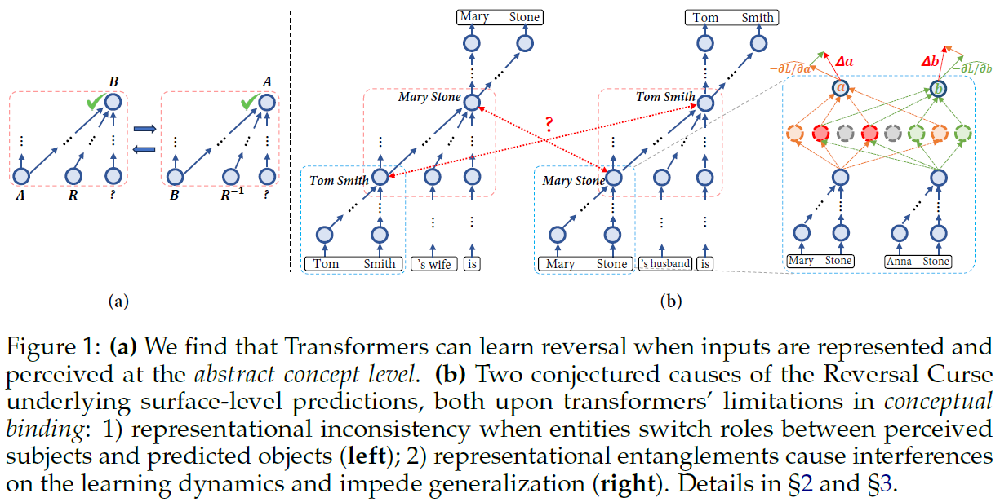

## Is the Reversal Curse a Binding Problem? Uncovering Limitations of Transformers from a Basic Generalization Failure

>Despite their impressive capabilities, LLMs exhibit a basic generalization failure known as the *Reversal Curse*, where they struggle to learn reversible factual associations. Understanding why this occurs could help identify weaknesses in current models and advance their generalization and robustness. In this paper, we conjecture that the Reversal Curse in LLMs is a manifestation of the long-standing *binding problem* in cognitive science, neuroscience and AI. Specifically, we identify two primary causes of the Reversal Curse stemming from transformers' limitations in conceptual binding: the *inconsistency* and *entanglements* of concept representations. We perform a series of experiments that support these conjectures. Our exploration leads to a model design based on JEPA (Joint-Embedding Predictive Architecture) that for the first time breaks the Reversal Curse without side-stepping it with specialized data augmentation or non-causal masking, and moreover, generalization could be further improved by incorporating special memory layers that support disentangled concept representations. We demonstrate that the skill of reversal unlocks a new kind of memory integration that enables models to solve large-scale arithmetic reasoning problems via *parametric forward-chaining*, outperforming frontier LLMs based on non-parametric memory and prolonged explicit reasoning.



### File Structure
```
RC/
├─  data_gen_*.ipynb: scripts for training/evaluation data generation
├─  main.py: main script for model training
├─  config.py: configuration for model training
├─  run_*.sh: command templates for running different model variants
├─  llm_tests/: cached testing data & model outputs for LLMs based on non-parametric memory
    ├─ q_{branching_factor}_{example_id}.txt: input prompt
    ├─ a_{branching_factor}_{example_id}.txt: ground truth answer
    ├─ {gemini/o3mini}_results/: predictions of Gemini-2.0-Flash-Thinking and o3-Mini-High
├─  arithmetic_llm.ipynb: data synthesis for LLM testing & cached evaluation results
└── utils.py: helper functions
```

### Environmental Setup
```bash
# python 3.9
pip install torch==2.4.0 torchvision==0.19.0 torchaudio==2.4.0 --index-url https://download.pytorch.org/whl/cu121
cd transformers
pip install -e .
cd ..
pip install fire pandas
```

### Data Preparation
- Run ```data_gen_{reversal/arithmetic}.ipynb``` to generate the training/testing data for reversal (section 2 & 3) and arithmetic reasoning (section 4), respectively. Details and parameters are in the notebooks.

### Model Training
- Command templates are provided in ```run_{normal/jepa/jepa_mem}.sh```, which correspond to the standard transformer, JEPA, and JEPA with memory layers respectively. Add ```--dont_save_models``` if you don't want to save the model checkpoints.
- Evaluation is done alongside training; results will be stored in ```{OUTPUT_DIR}/training_progress_scores.csv```.